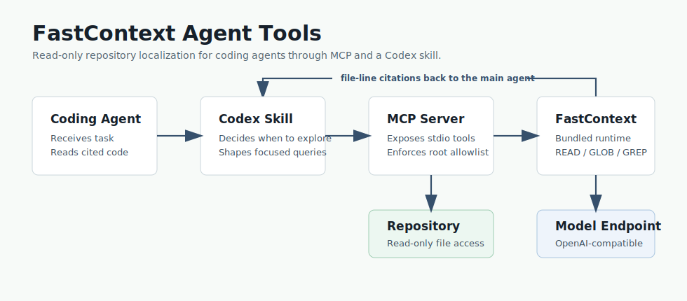

# FastContext Agent Tools

An MCP server and Codex skill that let a coding agent delegate repository
exploration to Microsoft's FastContext, a read-only search subagent.



FastContext answers one narrow question for your main agent:

> Which files and line ranges should I read before solving this task?

This repository provides the integration around that:

- `fastcontext-mcp`, a Python stdio MCP server that installs Microsoft
  FastContext as a pinned dependency.
- `skills/fastcontext-explorer`, a Codex skill that tells an agent when to
  delegate exploration.
- A Claude Code plugin (this repo is also a plugin marketplace).
- MCP setup guides in English, Traditional Chinese, and Japanese.

It does not bundle model weights, run inference, or modify repositories. The MCP
server runs the bundled `fastcontext.cli` in the same Python environment and
returns candidate file-line citations for the main agent to verify.

## Does it actually help? (read this first)

We ran an end-to-end A/B: the same "find the file" tasks, WITH vs WITHOUT
FastContext, across a strong and a weak main agent, on an easy and a hard repo
(file-hit rate, WITHOUT → WITH):

| | small/easy repo | large/hard repo (~433k LOC) |
|---|---|---|
| **Opus** (strong main agent) | 100 → 100 | 94 → 94 |
| **Qwen3.6-35B** (weak, local) | 100 → 100 | **60 → 66** |

**FastContext helps in exactly one situation: a weak or local main model working
in a large, hard codebase** — and even there the gain is modest (~+6 points) and
costs some latency. Under a frontier model like Opus it's a wash (the model finds
files fine on its own); on a small repo it's a wash (nothing to help with). It can
also occasionally *mislead* — a confident wrong citation the main agent believes.

So: **worth wiring up if you drive agents with small local models on big
repositories; skip it if you're on a frontier model or a modest codebase.** The
value tracks how much *your main agent* needs the help, not the explorer's own
accuracy. Full data and method: [benchmarks/](benchmarks/README.md) and
[benchmarks/ab/RESULTS.md](benchmarks/ab/RESULTS.md).

Separately, the locator in isolation is cheap and effective on small/medium repos
(~93–100% file-hit, ~25× less context for the locate phase) — a real efficiency,
just not one that changes end-to-end outcomes under a strong agent.

## About this fork

This is a maintained fork of [`Jakevin/fastcontext-agent-tools`](https://github.com/Jakevin/fastcontext-agent-tools)
that adds:

- **An MCP stdio framing fix.** The server speaks newline-delimited JSON, as the
  MCP spec requires. Upstream used LSP-style `Content-Length` framing, which
  spec-compliant clients such as Claude Code cannot connect to. Without this the
  server does not connect at all.
- **Two documented serving paths, Ollama recommended.** A GGUF quant under
  Ollama is the simplest setup and, on the cards tested, was at least as accurate
  as vLLM ([docs/running-on-ollama.md](docs/running-on-ollama.md)). vLLM is still
  documented for full BF16, maximum throughput, or very long contexts, with
  opt-in flags (`QUANT`, `GPU_MEM_UTIL`, `ENFORCE_EAGER`, `CTX_LEN`) that fit
  FastContext-4B onto an 8 GB card ([docs/running-locally.md](docs/running-locally.md)).
- **Accuracy defaults that measurably help.** Citation path re-rooting
  (`FASTCONTEXT_REROOT_PATHS`) recovers truncated paths the model emits;
  `FC_TEMPERATURE=0.2` raised the benchmark from 80% to 93%; and retry-on-empty
  (`FASTCONTEXT_EXPLORE_RETRIES`) re-runs the one failure mode that responds to
  a retry. The reasoning behind each is in [benchmarks/EXPERIMENTS.md](benchmarks/EXPERIMENTS.md).
- **A benchmark harness + an end-to-end A/B.** `benchmarks/` measures locator
  accuracy and context saving across GPUs/serving configs, and `benchmarks/ab/`
  runs the WITH-vs-WITHOUT-FastContext A/B that produced the "does it actually
  help?" verdict above (strong vs weak main agent × easy vs hard repo).

The `microsoft/fastcontext` dependency is pinned at commit
[`1522d6d`](https://github.com/microsoft/fastcontext/tree/1522d6d6b5e040e817b468e12826662aa069a8b0),
which includes five fixes reported from this work (issues #18–#22).

## Install as a Claude Code plugin

This repo is a plugin marketplace, so Claude Code can register the server in one
step without editing `~/.claude.json`:

```
/plugin marketplace add Scratchydisk/fastcontext-agent-tools
/plugin install fastcontext@scratchydisk
```

The plugin includes a `/fastcontext` slash command. Type `/fastcontext <what to
find>` and it runs an exploration and reports the verified citations, so you
don't have to call the tool by name.

The bundled `.mcp.json` starts the server with `uvx` straight from git, so there
is no venv to create or package to `pip install` (you need [uv](https://docs.astral.sh/uv/)
on `PATH`):

```jsonc
"command": "uvx",
"args": ["--from", "git+https://github.com/Scratchydisk/fastcontext-agent-tools@main", "fastcontext-mcp"]
```

### Point it at your endpoint

The plugin ships with a placeholder `BASE_URL`. Claude Code does not reliably
expand `${VAR}` in a plugin's `.mcp.json` env block ([Claude Code #9427](https://github.com/anthropics/claude-code/issues/9427)),
so set real values literally, one of two ways:

- For a single shared endpoint, edit `BASE_URL` (and `API_KEY`) in `.mcp.json`
  in your fork before publishing the marketplace.
- For a per-machine endpoint, register the server at user scope instead, where
  you control the values:

```bash
claude mcp add-json fastcontext --scope user '{
  "command": "uvx",
  "args": ["--from", "git+https://github.com/Scratchydisk/fastcontext-agent-tools@main", "fastcontext-mcp"],
  "env": {
    "BASE_URL": "http://127.0.0.1:11434/v1",
    "MODEL": "fc-q4-nothink-16k:latest",
    "API_KEY": "ollama",
    "FASTCONTEXT_ALLOWED_ROOTS": "/",
    "FC_TEMPERATURE": "0.2",
    "FASTCONTEXT_REROOT_PATHS": "1",
    "FASTCONTEXT_EXPLORE_RETRIES": "2"
  }
}'

# Confirm it connects:
claude mcp get fastcontext        # Status: Connected
```

Notes:

- `BASE_URL` and `MODEL` above are the Ollama defaults (a local Ollama on
  `:11434` serving the `fc-q4-nothink-16k` GGUF built in
  [docs/running-on-ollama.md](docs/running-on-ollama.md)). `MODEL` must match the
  name the endpoint serves. For vLLM it's `microsoft/FastContext-1.0-4B-RL` on
  `:30000`.
- `API_KEY` must match the server's key. Ollama ignores it, so any non-empty
  value works (`ollama`); for vLLM, match its `--api-key`, or use `""` for an
  unauthenticated endpoint.
- `FASTCONTEXT_ALLOWED_ROOTS` lists the local repositories exploration may
  target (`/` allows any path). The files are always read on the machine running
  the MCP server; only inference is remote.
- `FASTCONTEXT_REROOT_PATHS=1` is recommended on any endpoint. It corrects
  truncated citation paths and does nothing to paths that are already correct.
- `FC_TEMPERATURE=0.2` is recommended. FastContext defaults to 0.7, which is high
  for a deterministic locate task; lowering it raised the accuracy benchmark from
  80% to 93% (12/15 to 14/15 over three iterations) and made the search more
  deterministic, with fewer tool calls.
- `FASTCONTEXT_EXPLORE_RETRIES=2` re-runs an explore that came back with no
  citations (the dominant failure mode). It recovers most misses at ~1.4x average
  cost and is free when the first run answers. Set 0 to disable.
- The first call is slower while `uvx` builds the package, then it is cached.

The plugin assumes the model is already being served somewhere. To self-host it,
including the 8 GB small-GPU recipe, see [docs/running-locally.md](docs/running-locally.md).

### Make the agent actually reach for it

Installing the plugin makes FastContext *available*, but a coding agent will
often still default to its own built-in grep/read when locating code, so the
explorer goes unused. The fix is a directive in your `CLAUDE.md` (global
`~/.claude/CLAUDE.md`, or a project file) that makes delegation the default and
explicitly overrides that built-in reflex:

```markdown
## Code exploration — default to FastContext

RULE: When a task requires locating code, tracing logic across files, finding
where behaviour is implemented, or mapping what calls/depends on something, your
FIRST action MUST be the `fastcontext_explore` MCP tool (or the `/fastcontext`
command) — BEFORE any built-in Grep/Glob/Read sweep. Pass the repo root as
`repo_path` and a specific behaviour-named `query`. Treat the returned
file:line citations as candidates: open and verify them before acting.

This is the default for ALL languages. Do NOT fall back to manual grep/read
chains for multi-file exploration just because they're faster to reach.

Skip FastContext ONLY when:
- you've already read the exact file(s) in this session, or
- one known file + one obvious grep fully answers it, or
- the task is pure generation / non-code with no exploration needed.

If `fastcontext_health` reports the endpoint is down, say so and proceed with
built-in tools — don't silently skip it.
```

The narrow skip-list stops it firing on trivial one-file lookups, and the final
clause turns a down endpoint into a visible message rather than a silent
fallback that looks identical to the directive being ignored.

## Install for Codex

Ask an agent to set it up:

> Install FastContext Agent Tools from `https://github.com/Scratchydisk/fastcontext-agent-tools`.
> Its package installation includes Microsoft FastContext. Configure
> `python -m fastcontext_mcp` as a stdio MCP server with `BASE_URL`, `MODEL`,
> `API_KEY`, and `FASTCONTEXT_ALLOWED_ROOTS`, then enable `skills/fastcontext-explorer`.

Or run the install directly:

```bash
git clone https://github.com/Scratchydisk/fastcontext-agent-tools && cd fastcontext-agent-tools && python -m pip install -e . && mkdir -p "${CODEX_HOME:-$HOME/.codex}/skills" && ln -sfn "$(pwd)/skills/fastcontext-explorer" "${CODEX_HOME:-$HOME/.codex}/skills/fastcontext-explorer"
```

### Make the agent actually reach for it

As with the Claude Code plugin, the `fastcontext-explorer` skill being installed
doesn't guarantee Codex delegates to it — it will often default to its own
grep/read when locating code. Reinforce it with the same directive in your
`AGENTS.md` (the Codex equivalent of `CLAUDE.md`; global at
`~/.codex/AGENTS.md`, or a per-project file):

```markdown
## Code exploration — default to FastContext

RULE: When a task requires locating code, tracing logic across files, finding
where behaviour is implemented, or mapping what calls/depends on something, your
FIRST action MUST be the `fastcontext_explore` MCP tool (or the
`fastcontext-explorer` skill) — BEFORE any built-in grep/read sweep. Pass the
repo root as `repo_path` and a specific behaviour-named `query`. Treat the
returned file:line citations as candidates: open and verify them before acting.

This is the default for ALL languages. Do NOT fall back to manual grep/read
chains for multi-file exploration just because they're faster to reach.

Skip FastContext ONLY when:
- you've already read the exact file(s) in this session, or
- one known file + one obvious grep fully answers it, or
- the task is pure generation / non-code with no exploration needed.

If `fastcontext_health` reports the endpoint is down, say so and proceed with
built-in tools — don't silently skip it.
```

## How it works

Microsoft FastContext separates repository exploration from code solving. A
dedicated explorer uses read-only `READ`, `GLOB`, and `GREP` tools, issues
parallel tool calls, and returns compact `<final_answer>` citations. Microsoft
reports Mini-SWE-Agent gains of up to 5.5 points and up to 60% fewer main-agent
tokens.

Sources:

- Microsoft FastContext: <https://github.com/microsoft/fastcontext>
- Model card: <https://huggingface.co/microsoft/FastContext-1.0-4B-SFT>
- Paper: <https://arxiv.org/abs/2606.14066>

## Performance & tuning detail

The end-to-end verdict is up top ([Does it actually help?](#does-it-actually-help-read-this-first));
this is the supporting detail — the locator in isolation and the serving/tuning
findings. Full method and per-config results live in [benchmarks/](benchmarks/README.md),
[benchmarks/EXPERIMENTS.md](benchmarks/EXPERIMENTS.md), and
[benchmarks/ab/RESULTS.md](benchmarks/ab/RESULTS.md). The isolated-locator query
sets are small (5 on this repo, 10 on the large one), so treat single numbers as
indicative, not a leaderboard.

**Context saving.** Delegating the locate phase keeps the search out of the main
agent's context. Across the answered queries, about 1.6k tokens entered the main
context with FastContext versus about 43k doing the same search inline, roughly
25x less for that phase.

**Accuracy.** With the tuned defaults (`FC_TEMPERATURE=0.2`, re-rooting on,
retry-on-empty), a Q4 GGUF hit 14–15 of 15 on Ampere cards. A few findings that
shaped the recommended setup:

- Ollama with a Q4_K_M GGUF matched or beat vLLM on the same card; the GGUF path
  is not second-class.
- A 6-bit quant was worse than 4-bit on every card and slower. 4-bit is the
  sweet spot.
- `OLLAMA_KV_CACHE_TYPE=q4_0` substantially degrades agentic accuracy (roughly
  halved in a clean single-variable test, worse with parallel slots) and sharply
  cuts tool-calling. Leave the KV cache at fp16.
- A Pascal card (compute < 7.0) runs the model under Ollama but is slow and much
  less accurate; use a card that supports vLLM for real work.

## Manual install

```bash
git clone https://github.com/Scratchydisk/fastcontext-agent-tools
cd fastcontext-agent-tools
python -m pip install -e .
python -m fastcontext_mcp --print-health
```

If your Python scripts directory is on `PATH`, `fastcontext-mcp --print-health`
works too. Installing the package also installs Microsoft FastContext from the
pinned source revision, so no separate FastContext checkout is needed.

Requirements:

- Python 3.12 or newer.
- An OpenAI-compatible endpoint serving a FastContext model.

Set the endpoint environment before starting the server:

```bash
export BASE_URL="http://127.0.0.1:11434/v1"      # local Ollama
export MODEL="fc-q4-nothink-16k:latest"
export API_KEY="ollama"
export FASTCONTEXT_ALLOWED_ROOTS="/path/to/repos"
```

`FASTCONTEXT_ALLOWED_ROOTS` is an `os.pathsep`-separated allowlist. If unset, the
server only allows repositories under the directory it was started in.

## MCP configuration

For an MCP client other than the Claude Code plugin, add a stdio server:

```json
{
  "mcpServers": {
    "fastcontext": {
      "command": "python",
      "args": ["-m", "fastcontext_mcp"],
      "env": {
        "BASE_URL": "http://127.0.0.1:11434/v1",
        "MODEL": "fc-q4-nothink-16k:latest",
        "API_KEY": "ollama",
        "FASTCONTEXT_ALLOWED_ROOTS": "/path/to/repos",
        "FC_TEMPERATURE": "0.2",
        "FASTCONTEXT_REROOT_PATHS": "1",
        "FASTCONTEXT_EXPLORE_RETRIES": "2"
      }
    }
  }
}
```

Localized guides: [Traditional Chinese](docs/mcp.zh-TW.md), [Japanese](docs/mcp.ja.md).

## MCP tools

`fastcontext_health` checks that the bundled `fastcontext.cli` is importable, the
endpoint environment is set, and — by default — **live-probes the model** with a
1-token completion so `ok` is true only if `MODEL`@`BASE_URL` actually responds.
This catches the cases a config-only check misses: a wrong `MODEL`
(`status: model_not_found`), a down or wrong endpoint (`unreachable`), or a model
still loading (`timeout`). It also reports the configured values (`BASE_URL`,
`MODEL`, allowed roots, tuning vars), with `API_KEY` masked, plus an `effective`
block showing what takes effect once defaults are applied. Pass `probe: false`
for a config-only check with no network call, or set `FASTCONTEXT_HEALTH_TIMEOUT`
(seconds) to tune the probe.

`fastcontext_explore` runs FastContext against a repository and returns parsed
citations plus the raw output:

```json
{
  "repo_path": "/path/to/repo",
  "query": "Locate the request validation logic for uploaded files",
  "max_turns": 6,
  "citation": true,
  "timeout_seconds": 300
}
```

`fastcontext_explore_with_trace` does the same but saves a JSONL trajectory. A
relative `trajectory_path` resolves inside `repo_path`.

Citations are candidate evidence. Read the cited files before changing code.

## Codex skill

The skill lives at `skills/fastcontext-explorer`. Install it by symlinking the
folder into your Codex skills directory:

```bash
mkdir -p "${CODEX_HOME:-$HOME/.codex}/skills"
ln -s "$(pwd)/skills/fastcontext-explorer" "${CODEX_HOME:-$HOME/.codex}/skills/fastcontext-explorer"
```

Use it when a task needs repository localization before editing.

## Running the model locally

Serving the model is two independent processes:

1. The model server: an OpenAI-compatible endpoint serving the FastContext model
   on the GPU. Long-running. This can be Ollama or vLLM.
2. The MCP server: `python -m fastcontext_mcp`, spawned over stdio by the agent
   client. Lightweight (no torch). It shells out to `fastcontext.cli`, which
   calls the model server and returns citations.

The `READ`, `GLOB`, and `GREP` tools run inside the `fastcontext.cli` process,
not on the model server, so the repository being explored must live on the
machine running the MCP server. The model server only does inference.

### Ollama (recommended)

Simplest to set up, and on the cards tested it was at least as accurate as vLLM.
Serve a GGUF quant on the standard Ollama endpoint (`http://127.0.0.1:11434/v1`)
and point the MCP server at it. The model needs a small one-time Modelfile (it's
a reasoning model, so a "no-think" prefix is required) and the KV cache must stay
at fp16. The full recipe, including context sizing and the GPU-pinning and
KV-cache gotchas, is in [docs/running-on-ollama.md](docs/running-on-ollama.md).

### vLLM (full precision, max throughput)

Worth it when you want full BF16, the highest throughput, or contexts past what a
GGUF setup holds. Run it with the helper scripts:

```bash
# Terminal 1: serve the model (the first run downloads ~8 GB of weights).
export HF_TOKEN=hf_...        # avoids an unauthenticated Hugging Face rate-limit stall
./scripts/serve-model.sh      # wait for "Application startup complete" on :30000

# Terminal 2: health check, then a live exploration.
./scripts/kickoff.sh          # configuration health, no model needed
./scripts/kickoff.sh explore  # runs a real exploration against this repo
```

`serve-model.sh` already passes `--enable-auto-tool-choice --tool-call-parser
hermes`, which FastContext requires (it reads server-side `tool_calls`). If
`explore` returns no citations, try `--tool-call-parser qwen3_xml` instead. It
also has opt-in flags to fit the model onto an 8 GB card. For VRAM and
context-length sizing, see [docs/running-locally.md](docs/running-locally.md).

## Test it

Two checks, in order.

**1. Config and connectivity (no model needed).**

```bash
fastcontext-mcp --print-health     # or: python -m fastcontext_mcp --print-health
```

This confirms the package imports and the endpoint env is set. `No module named
'fastcontext_mcp'` means you're running a Python where the package isn't
installed: run `python -m pip install -e .` in that interpreter (or use the
uvx/plugin launch, which handles it). This is the first thing to check if the
model never even loads, since a failed import never reaches the endpoint.

**2. Live end-to-end (loads the model).** Ask the agent to locate something with
a known answer in this repo. With the plugin installed, in Claude Code:

```
/fastcontext where is the stdio message framing that reads and writes JSON-RPC messages?
```

A healthy setup cites `src/fastcontext_mcp/server.py`. The first call also pulls
the model into VRAM (a few seconds on a cold endpoint), so `ollama ps` (or
`nvidia-smi`) should show it resident afterwards.

Run the live check through the agent (the `/fastcontext` command or the
`fastcontext_explore` tool), not by calling `fastcontext.cli` directly with a
bare query. The MCP server wraps each call with a workspace-root prompt, path
re-rooting, and retry-on-empty; a bare CLI query has none of that and will often
return an empty answer on a setup that is actually fine. If the agent path
returns empty, the usual causes are a missing `FC_TEMPERATURE=0.2` /
`FASTCONTEXT_REROOT_PATHS=1` in the env block (the model truncates workspace
paths and its tool calls fail), or, on Ollama, the no-think or KV-cache traps in
the guide above. A connection error points at `BASE_URL` or the tunnel.

## Hosting the model on a remote server

Only inference moves to the remote box. The MCP server and `fastcontext.cli`,
which read your repository files, stay local. The remote host needs the GPU and
the model; your machine keeps the repositories. This works the same whichever
engine serves the model: run it on the remote host and reach it over an SSH
tunnel (`ssh -L 30000:127.0.0.1:11434 gpuhost` for Ollama, or `:30000` for
vLLM), then point `BASE_URL` at the local end of the tunnel.

For the Ollama path, the [Ollama guide](docs/running-on-ollama.md) covers the
tunnel and env block directly. The vLLM equivalent, on the remote GPU host:

```bash
uv pip install vllm
vllm serve microsoft/FastContext-1.0-4B-RL \
    --host 0.0.0.0 --port 30000 \
    --enable-auto-tool-choice --tool-call-parser hermes \
    --max-model-len 65536 --gpu-memory-utilization 0.9 \
    --trust-remote-code \
    --api-key "$REMOTE_API_KEY"
```

On the local machine, point the endpoint variables at the remote host. For the
shell scripts set them in `scripts/env.local.sh`; for Claude Code, pass them in
the MCP registration (see the `claude mcp add-json` example above).

```bash
export BASE_URL="https://fastcontext.example.com/v1"
export MODEL="microsoft/FastContext-1.0-4B-RL"
export API_KEY="$REMOTE_API_KEY"                  # must match the server's --api-key
export FASTCONTEXT_ALLOWED_ROOTS="/home/you/git"  # local: your repositories live here
```

Running this safely:

- **Transport security.** vLLM serves plain HTTP. Don't expose `:30000`
  directly. Either put it behind a TLS reverse proxy (nginx, Caddy) forwarding to
  `127.0.0.1:30000` and use an `https://` `BASE_URL`, or keep vLLM bound to
  localhost and reach it over an SSH tunnel
  (`ssh -L 30000:127.0.0.1:30000 gpuhost`), leaving `BASE_URL` as
  `http://127.0.0.1:30000/v1`. The tunnel is the simplest secure option and
  needs no API key.
- **Authentication.** With direct exposure, set `--api-key` on the server and a
  matching `API_KEY` locally. Otherwise anyone who reaches the port can use your
  GPU.
- **Firewall.** Restrict the port to known clients even behind a proxy.
- **Latency.** Each exploration is a multi-turn loop, so every turn is a round
  trip to the model. Keep the host close, and raise `timeout_seconds` on the
  call if the link is slow.
- **Managed endpoints.** Any OpenAI-compatible service hosting the model works.
  Set `BASE_URL`, `API_KEY`, and `MODEL` and nothing else changes.

## Development

```bash
PYTHONPATH=src python -m unittest discover -s tests
```

Validate the Codex skill:

```bash
python /path/to/skill-creator/scripts/quick_validate.py skills/fastcontext-explorer
```

## Safety

- The server exposes no edit or write tools.
- `repo_path` must resolve under `FASTCONTEXT_ALLOWED_ROOTS`.
- Secrets are read from environment variables only.
- Trajectories are written only when requested.

A full project report is in [docs/REPORT.md](docs/REPORT.md).

## License

MIT
