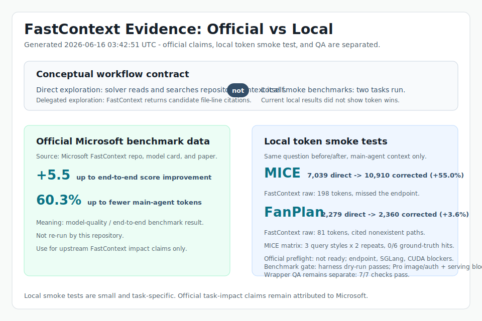

# Evaluation

This project currently has two evidence layers:

1. Local integration QA for this MCP server and Codex skill package.
2. Model-quality evidence from the upstream Microsoft FastContext project.



The summary image is intentionally split by data source and evidence type:

- Official Microsoft FastContext benchmark data.
- Local wrapper QA checks from this repository.
- Local before/after token smoke tests for MICE and FanPlan Android.

`FanPlan` is an anonymized local Android app fixture name used for reporting.

## Local Integration QA

The repeatable local check is:

```bash
python -m evaluation.run_wrapper_eval
```

Last checked result committed in `evaluation/wrapper-eval.json`:

| Check | Result | Evidence |
| --- | --- | --- |
| Unit tests | PASS | Runs 13 tests covering parser, runtime, server, and wrapper behavior |
| MCP initialize | PASS | Starts the stdio server and completes JSON-RPC `initialize` |
| MCP tool discovery | PASS | Verifies `tools/list` exposes `fastcontext_health`, `fastcontext_explore`, and `fastcontext_explore_with_trace` |
| Health uses bundled CLI | PASS | Verifies `fastcontext_health` reports `fastcontext_mcp.fastcontext_cli` as the command module |
| Citation parsing | PASS | Runs `fastcontext_explore` through a fake FastContext CLI and parses two file-line citations |
| Trace output | PASS | Runs `fastcontext_explore_with_trace` and verifies the trajectory file is written inside the repo |
| Path allowlist guard | PASS | Calls a repo outside `FASTCONTEXT_ALLOWED_ROOTS` and verifies it is rejected |

Scope:

- MCP protocol basics: `initialize`, `tools/list`, and `tools/call`.
- Tool contract: `fastcontext_health`, `fastcontext_explore`, and `fastcontext_explore_with_trace`.
- Citation parsing from a FastContext-style `<final_answer>` block.
- Read-safety guard through `FASTCONTEXT_ALLOWED_ROOTS`.
- Trace file creation when `trajectory_path` is supplied.

Limitation:

- This wrapper evaluation uses a fake `fastcontext.cli` package so it can run without a GPU or model endpoint.
- It proves the integration wrapper, not FastContext model quality or before/after task impact.

## Local Before/After Token Smoke Tests

Two local before/after token smoke tests are committed:

- `evaluation/local-before-after-results.json` for the latest aggregate run
- `evaluation/mice-checkin-before-after.json`
- `evaluation/fanplan-fcm-before-after.json`

Token measurement uses `tiktoken` `cl100k_base` as a consistent local estimator
for main-agent context. It does not include FastContext's internal endpoint
tokens.

### MICE Check-In Endpoint

Question:

> Locate the central check-in verification endpoint that writes Log records,
> marks tickets as used, updates subTickets, and may enqueue Printer jobs.

Project under test:

```text
/Users/jakevinlo/project/NodeProject/mice-gcloud-version
```

Ground truth:

- `app/routers/logs.js`
- `POST /log/add`
- Relevant lines include `192`, `233`, `275`, `304`, and `340`.

| Condition | Main-agent context tokens | Correctly found ground truth? | Notes |
| --- | ---: | --- | --- |
| Direct exploration | 7,039 | Yes | Search task symbols, then read `app/routers/logs.js:192-360` |
| FastContext raw output | 198 | No | Returned dashboard citations, but missed `app/routers/logs.js` |
| FastContext cited-file verification plus fallback | 10,910 | Yes | Had to read incorrect citations, then fall back; +55.0% tokens versus direct |

For this local task, FastContext did not produce a token win when correctness is
required. The raw response was short, but the missed citation forced fallback.

### FanPlan Android FCM

Question:

> Locate where FCM push notifications are received in the Android app, how
> `RemoteMessage` data is parsed into `NotificationEntity`, and where the
> Firebase messaging service is registered in the manifest.

Project under test:

```text
/path/to/FanPlan_Android
```

The local source path and package names are anonymized in this public artifact.

Ground truth:

- `android/app/src/main/java/com/example/fanplan/android/FanPlanFirebaseMessagingService.kt`
- `android/app/src/main/AndroidManifest.xml`

| Condition | Main-agent context tokens | Correctly found ground truth? | Notes |
| --- | ---: | --- | --- |
| Direct exploration | 2,279 | Yes | Search FCM symbols, then read service and manifest ranges |
| FastContext raw output | 81 | No | Cited nonexistent FanPlan paths |
| FastContext cited-file verification plus fallback | 2,360 | Yes | No cited file could be read, then fallback; +3.6% tokens versus direct |

For this local task, FastContext again returned a short answer but did not
produce a correct localization without fallback.

### Re-Running

The repeatable harness is:

```bash
uv run --extra dev python -m evaluation.token_benchmark evaluation/token-benchmark-tasks.json --output evaluation/local-before-after-results.json
```

It requires a FastContext-compatible endpoint and `tiktoken`.
The FanPlan task uses anonymized paths in the committed task file; replace
`/path/to/FanPlan_Android` with a local fixture path before re-running it.

A broader local benchmark should compare the same coding tasks under two
conditions:

- Direct exploration: the main agent reads and searches the repository itself.
- FastContext-delegated exploration: the main agent asks FastContext for
  candidate file-line citations, then solves from that focused evidence.

Both conditions need the same main agent, same endpoint configuration, same task
set, and measured outcomes such as task success, main-agent tokens, wall time,
and cited-file precision.

## Upstream Model Evidence

The model-quality claims should be attributed to Microsoft FastContext:

- Project: <https://github.com/microsoft/fastcontext>
- Model card: <https://huggingface.co/microsoft/FastContext-1.0-4B-SFT>
- Paper: <https://arxiv.org/abs/2606.14066>

Microsoft reports that FastContext is a lightweight repository-exploration subagent using read-only `READ`, `GLOB`, and `GREP` tools, returning compact file-line citations. Their reported Mini-SWE-Agent integration results include up to 5.5 score improvement and up to 60.3% main-agent token reduction across SWE-bench Multilingual, SWE-bench Pro, and SWE-QA.

This repository does not re-run those benchmarks. Reproducing them requires the upstream benchmark harness, task datasets, and configured main-agent and FastContext model endpoints.
